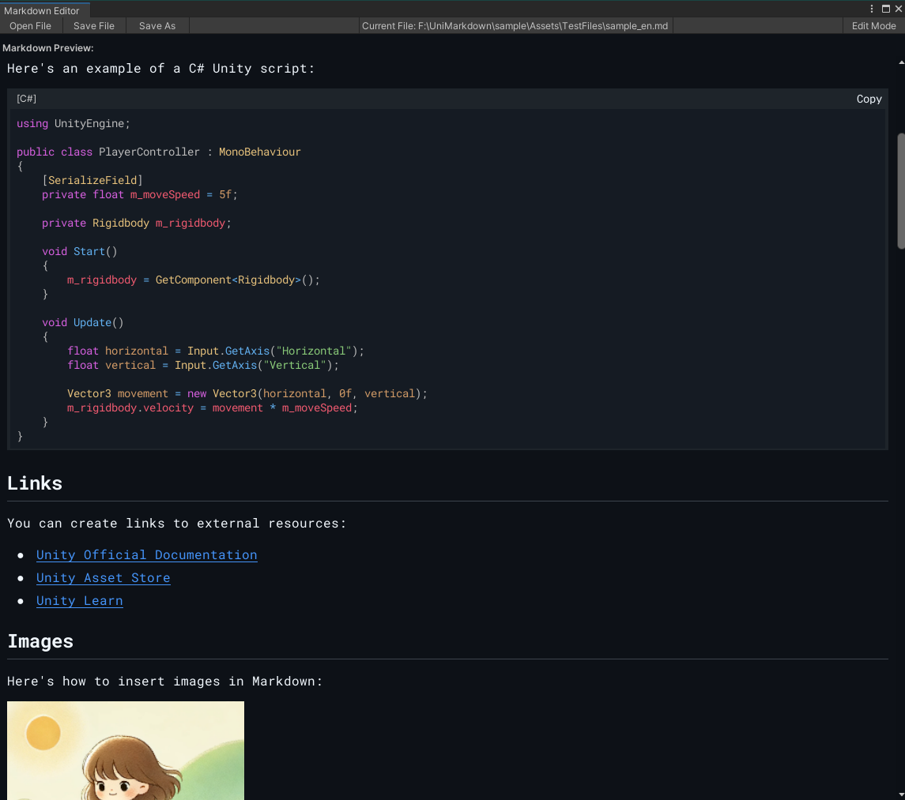
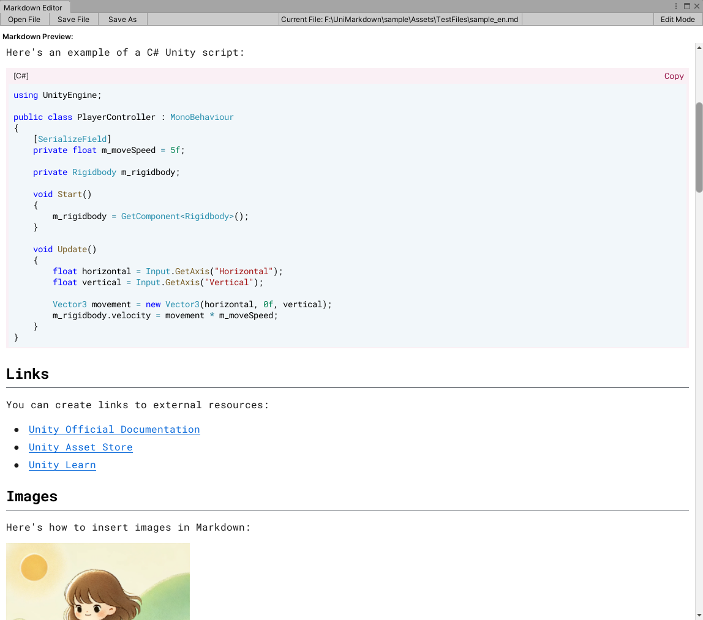

# UniMarkdown

  
  
    

  
  

  

  

[中文说明](./README.zh.md) | English

> **The ultimate native Markdown editor for Unity. Fast, beautiful, and deeply integrated.**

<!-- Dynamic badges (uncomment and replace OWNER/REPO after publishing)

-->

## Demo & Screenshots 🖼️

### 🎥 Live Demo

### 🌙 Dark Theme

### ☀️ Light Theme  

## Why UniMarkdown? ❓

-   ✅ **Native Integration**: More than just an editor, it seamlessly blends with your Unity workflow (double-click to open, Inspector previews).
-   ✅ **High Performance**: Built with compiled Regex and object pooling to handle large documents smoothly without editor lag.
-   ✅ **Highly Extensible**: Easily add custom syntax highlighters and element renderers to meet your team's specific needs.
-   ✅ **Familiar Feel**: A perfect replica of the GitHub style you know and love, with consistent theming 🎉.

## Features ✨

-   ✅ **Editor & Preview**: A standalone editor window and live previews directly within the Inspector.
-   ✅ **Workflow Integration**: Supports opening `.md` files directly with a double-click.
-   ✅ **GitHub Style**: Automatically adapts to the Unity editor's dark/light themes.
-   ✅ **Full Syntax Support**: Headers, lists, task lists, code blocks, quotes, images, links, and more.
-   ✅ **Extended Syntax**:
    -   Image size control (`=300x200`, `{width=50%}`, etc.).
    -   Advanced formatting and custom extensions.
-   ✅ **Enhanced Code Blocks**:
    -   Syntax highlighting for multiple languages (C#/JSON built-in, extensible).
    -   One-click copy button with an animated confirmation.
-   ✅ **High Performance**: Core parsing logic is optimized to minimize GC Alloc.
-   ✅ **Easy to Extend**: Modular renderer and syntax highlighting systems.

## Performance & Compatibility 📊

| Metric | Status | Details |
|--------|--------|---------|
| **Unity Version** | ✅ | 2021.3+ LTS |
| **Editor Performance** | ✅ | < 1ms parsing, GC-optimized |
| **File Size Support** | ✅ | Tested up to 10MB+ documents |
| **Theme Compatibility** | ✅ | Auto-adapts to Dark/Light |
| **Platform Support** | ✅ | Editor-only, all Unity platforms |

## Install & Quick Start 🚀

### 📦 Installation Methods

#### 🌟 Option A: Unity Package Manager (Recommended)

1. Open Unity → **Window** → **Package Manager**
2. Click the **+** button → **"Add package from git URL..."**
3. Enter: `https://github.com/QueCue/UniMarkdown.git?path=src`
4. Click **Add** and wait for Unity to import

**✅ Benefits**: Easy updates, clean project structure, automatic dependency management  
**🔄 To Update**: Select UniMarkdown in Package Manager → Click **Update**

#### Option B: Direct Copy (For custom modifications)

1. Download or clone this repository
2. Copy `src/Editor` folder to `Assets/UniMarkdown/` in your Unity project
3. Unity will automatically detect and compile the package

**ℹ️ Use case**: When you need to modify the source code directly

### 🎯 Quick Usage

1. **Inspector Preview**: Select any `.md` file in Project window to see live preview
2. **Editor Window**: *Window → UniMarkdown* (if available) for dedicated editing
3. **Double-click**: Open `.md` files directly (when configured)

### Extend (2-min how-to) ⚡

-   Renderers: add a class under `ElementRenderers/` inheriting `BaseElementRenderer`, then register it in `ElementRendererFactory` (element type → renderer).
-   Syntax highlighting: implement `ISyntaxHighlighting` and register it in `SyntaxManager` (see built-ins for C#/JSON).

Tips: keep GUI paths allocation-free and reuse styles via `MarkdownStyleManager`.

## Renderer Support Status 🎯

### ✅ Currently Supported

#### Core Elements
- **Text Formatting**: Text, Bold, Italic, BoldItalic
- **Headers**: H1-H6 with styling
- **Line Breaks**: Soft line break / Hard line break
- **Dividers**: Horizontal rules

#### Lists & Navigation
- **Lists**: Unordered/ordered lists with nesting support
- **Task Lists**: Interactive checkboxes with nesting
- **Links**: Internal and external linking

#### Rich Content
- **Images**: Full support with size parameters (`=300x200`, `{width=50%}`)
- **Code Blocks**: Syntax highlighting (C#/JSON built-in, extensible)
- **Inline Code**: Styled code snippets
- **Tables**: Column alignment and formatting

### 🚧 Roadmap (Planned Features)
- **Enhanced Text**: Emoji support, Strikethrough
- **Code Improvements**: Line numbers for code blocks
- **Rich Blocks**: Blockquote, Footnotes
- **Advanced**: Callout/Admonition blocks (tip/note/warning)
- **Diagrams**: Mermaid support (via external rendering)

## Contributing 🤝

We welcome contributions from the community! Here's how you can help:

- 🐛 **Bug Reports**: Found an issue? [Open an issue](https://github.com/QueCue/UniMarkdown/issues/new)
- 💡 **Feature Requests**: Have an idea? We'd love to hear it!
- 🔧 **Pull Requests**: Code contributions are welcome (discuss major changes first)
- ⭐ **Star the Project**: If UniMarkdown helps you, please give us a star!

## Documentation 📚

- **Changelog**: [`CHANGELOG.md`](./CHANGELOG.md) | [`CHANGELOG.zh.md`](./CHANGELOG.zh.md)
- **License**: [MIT License](./LICENSE)
- **Version**: `0.1.0-Preview` (Unity 2021.3+)

---

*UniMarkdown - The Markdown Companion for Unity Developers*

