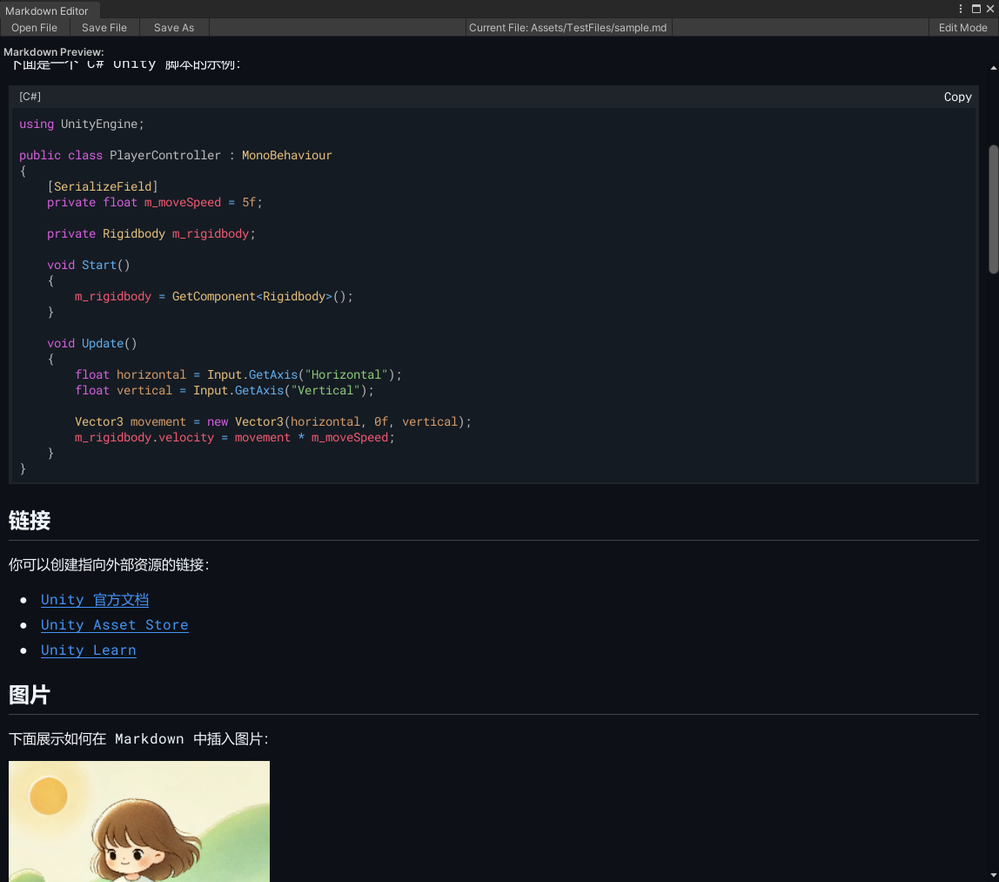
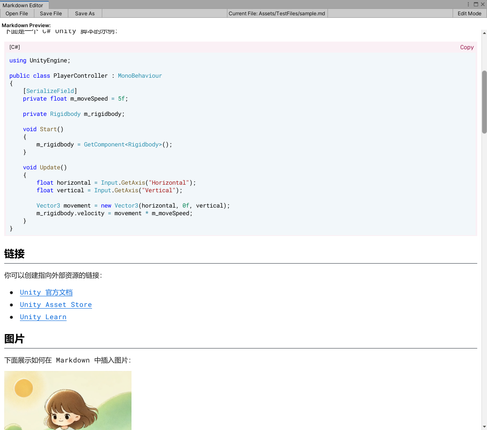

# UniMarkdown

  
  
    

  
  

  

  

<!-- Language Switch -->
中文说明 | [English](./README.md)

> **Unity 原生 Markdown 终极解决方案。高速、美观、深度集成。**

<!-- 可在仓库创建后启用的动态徽章示例：请将 OWNER/REPO 替换为实际值

-->

## 演示与截图 🖼️

### 🎥 动态演示

### 🌙 深色主题

### ☀️ 浅色主题  

## 为什么选择 UniMarkdown ❓

-   ✅ **原生集成 (Native Integration)**: 不只是个编辑器，更是与 Unity 工作流（双击打开、Inspector 预览）的无缝融合。
-   ✅ **性能卓越 (High Performance)**: 基于编译后 Regex 与对象池，处理大型文档依然流畅，无惧卡顿。
-   ✅ **高度可扩展 (Extensible)**: 轻松添加自定义语法高亮和元素渲染器，满足团队特殊需求。
-   ✅ **熟悉的感觉 (Familiar Feel)**: 完美复刻 GitHub 风格，无需学习成本，主题一致性出色 🎉。

## 特性亮点 ✨

-   ✅ **编辑器与预览**：独立的编辑器窗口与 Inspector 内实时预览。
-   ✅ **工作流集成**：支持双击 `.md` 文件直接打开。
-   ✅ **GitHub 风格**：自动适配 Unity 编辑器的深色/浅色主题。
-   ✅ **完整语法支持**：标题、列表、任务清单、代码块、引用、图片、链接等。
-   ✅ **扩展语法**：
    -   图片尺寸控制 (`=300x200`, `{width=50%}` 等)。
    -   高级格式化和自定义扩展功能。
-   ✅ **代码块增强**：
    -   多种语言语法高亮 (内置 C#/JSON，可扩展)。
    -   一键复制代码并伴有动画提示。
-   ✅ **高性能**：核心解析逻辑经过优化，避免不必要的 GC Alloc。
-   ✅ **易于扩展**：模块化的渲染器和语法高亮系统。

## 性能与兼容性 📊

| 指标 | 状态 | 详情 |
|------|------|------|
| **Unity 版本** | ✅ | 2021.3+ LTS |
| **编辑器性能** | ✅ | < 1ms 解析，GC 优化 |
| **文件大小支持** | ✅ | 测试支持 10MB+ 文档 |
| **主题兼容性** | ✅ | 自动适配深色/浅色主题 |
| **平台支持** | ✅ | 仅编辑器，支持所有 Unity 平台 |

## 安装与快速开始 🚀

### 📦 安装方式

#### 🌟 方式 A：Unity Package Manager（推荐）

1. 打开 Unity → **Window** → **Package Manager**
2. 点击 **+** 按钮 → **"Add package from git URL..."**
3. 输入：`https://github.com/QueCue/UniMarkdown.git?path=src`
4. 点击 **Add** 并等待 Unity 导入

**✅ 优势**：便于更新、项目结构清洁、自动依赖管理  
**🔄 升级方式**：在 Package Manager 选中 UniMarkdown → 点击 **Update**

#### 方式 B：直接复制（用于自定义修改）

1. 下载或克隆此仓库
2. 将 `src/Editor` 文件夹复制到你的工程 `Assets/UniMarkdown/`
3. Unity 会自动检测并编译该包

**ℹ️ 适用场景**：需要直接修改源代码时使用

### 🎯 快速使用

1. **Inspector 预览**：在 Project 窗口选择任意 `.md` 文件即可看到实时预览
2. **编辑器窗口**：*Window → UniMarkdown*（如可用）进行专门编辑
3. **双击打开**：直接双击 `.md` 文件打开（配置后）

### 扩展（2 分钟上手） ⚡

-   渲染器：在 `ElementRenderers/` 下新建继承 `BaseElementRenderer` 的类，并在 `ElementRendererFactory` 注册（元素类型 → 渲染器）。
-   语法高亮：实现 `ISyntaxHighlighting` 并在 `SyntaxManager` 注册（参考内置 C#/JSON）。

提示：在 GUI 循环中避免分配，样式建议统一由 `MarkdownStyleManager` 复用管理。

## 渲染器支持情况 🎯

### ✅ 当前支持功能

#### 核心元素
- **文本格式化**：文本、粗体、斜体、粗斜体
- **标题**：H1-H6 及样式
- **换行**：软换行 / 硬换行
- **分割线**：水平分割线

#### 列表与导航
- **列表**：无序/有序列表，支持嵌套
- **任务清单**：交互式复选框，支持嵌套
- **链接**：内部和外部链接

#### 丰富内容
- **图片**：完整支持，带尺寸参数（`=300x200`、`{width=50%}`）
- **代码块**：语法高亮（内置 C#/JSON，可扩展）
- **行内代码**：样式化代码片段
- **表格**：列对齐和格式化

### 🚧 开发路线图（计划功能）
- **增强文本**：Emoji 支持、删除线
- **代码改进**：代码块行号
- **丰富块**：引用块、脚注
- **高级功能**：Callout/Admonition 块（提示/注意/警告）
- **图表**：Mermaid 支持（通过外部渲染）

## 贡献与开发 🤝

我们欢迎社区贡献！以下是参与方式：

- 🐛 **Bug 报告**：发现问题？[提交 Issue](https://github.com/QueCue/UniMarkdown/issues/new)
- 💡 **功能建议**：有好想法？我们很乐意听到！
- 🔧 **代码贡献**：欢迎提交 PR（大型改动请先讨论）
- ⭐ **给项目点星**：如果 UniMarkdown 对你有帮助，请给我们点个星！

## 项目文档 📚

- **更新日志**：[`CHANGELOG.zh.md`](./CHANGELOG.zh.md) | [`CHANGELOG.md`](./CHANGELOG.md)
- **许可证**：[MIT 许可证](./LICENSE)
- **版本**：`0.1.0-Preview`（Unity 2021.3+）

---

*UniMarkdown - 为 Unity 开发者打造的 Markdown 伴侣*

