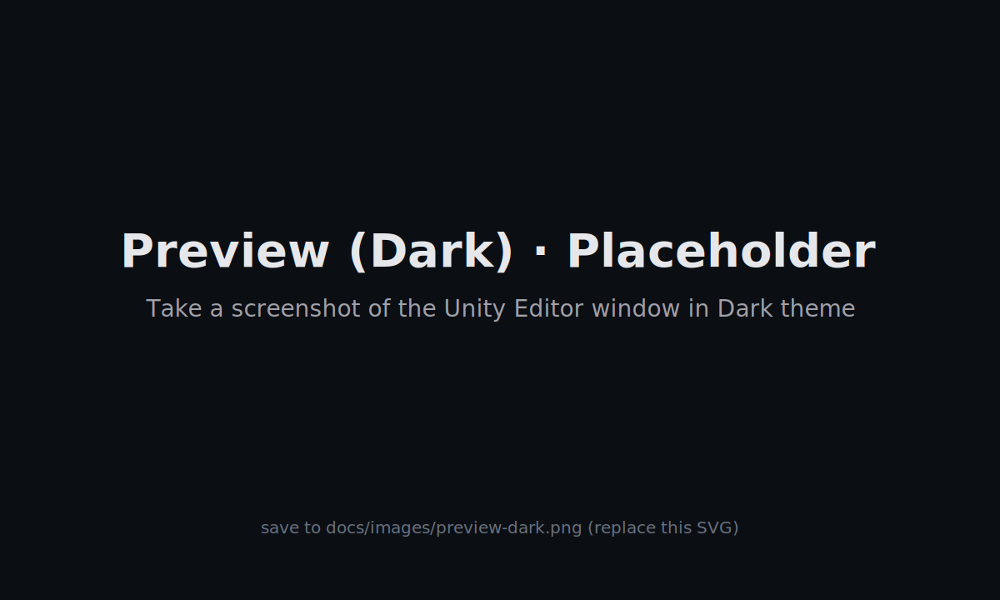
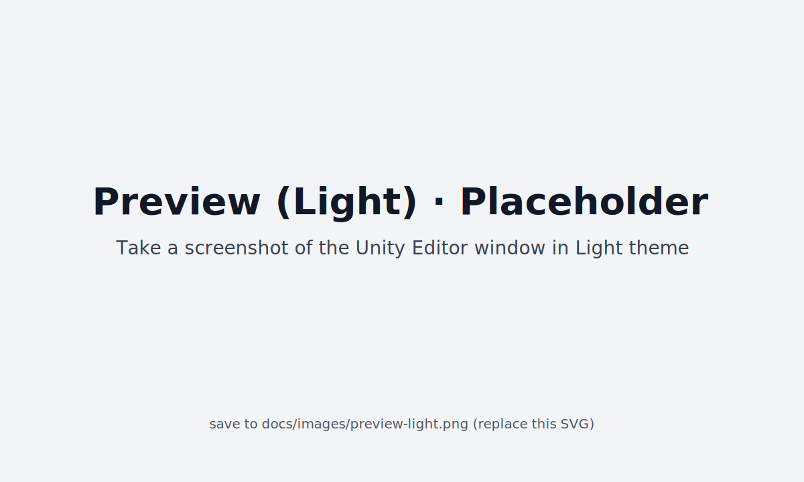

# UniMarkdown

[中文说明](./README.zh.md) | English

> **The ultimate native Markdown editor for Unity. Fast, beautiful, and deeply integrated.**

---

<!-- Dynamic badges (uncomment and replace OWNER/REPO after publishing)

-->

## Demo & Screenshots 🖼️

{width=45%}
{width=45%}

> These are placeholders. Replace with your real `docs/images/demo.gif` and `preview-dark.png` / `preview-light.png` after recording.

---

## Why UniMarkdown? ❓

-   ✅ **Native Integration**: More than just an editor, it seamlessly blends with your Unity workflow (double-click to open, Inspector previews).
-   ✅ **High Performance**: Built with compiled Regex and object pooling to handle large documents smoothly without editor lag.
-   ✅ **Highly Extensible**: Easily add custom syntax highlighters and element renderers to meet your team's specific needs.
-   ✅ **Familiar Feel**: A perfect replica of the GitHub style you know and love, including Emoji support 🎉.

---

## Features ✨

-   ✅ **Editor & Preview**: A standalone editor window and live previews directly within the Inspector.
-   ✅ **Workflow Integration**: Supports opening `.md` files directly with a double-click.
-   ✅ **GitHub Style**: Automatically adapts to the Unity editor's dark/light themes.
-   ✅ **Full Syntax Support**: Headers, lists, task lists, code blocks, quotes, images, links, and more.
-   ✅ **Extended Syntax**:
    -   Image size control (`=300x200`, `{width=50%}`, etc.).
    -   Emoji support (`:tada:`, `:rocket:`, etc.).
-   ✅ **Enhanced Code Blocks**:
    -   Syntax highlighting for multiple languages (C#/JSON built-in, extensible).
    -   One-click copy button with an animated confirmation.
-   ✅ **High Performance**: Core parsing logic is optimized to minimize GC Alloc.
-   ✅ **Easy to Extend**: Modular renderer and syntax highlighting systems.

---

## Install & Quick Start 🚀

-   Copy the `Assets/Scripts/Editor/MarkdownForEditor/` directory into your project.
-   **Open the Window**:
    -   Via the menu: `Tools/Markdown编辑器/打开Markdown编辑器`.
    -   Or by **double-clicking** any `.md` file in the Project window.
-   **Load a Sample**:
    -   `Tools/Markdown编辑器/加载示例文件`.

> For more details, please read `docs/Usage.md`.

---

## Contributing 🤝

We welcome all forms of contributions! Feel free to open an issue, submit a pull request, or help improve the documentation.

-   **Contribution Guidelines**: Please see `docs/CONTRIBUTING.md`.
-   **Development Suggestions**: We encourage adding test cases in `Tests/TestFiles`.

**If you find this project helpful, please give it a Star ⭐️—it's the best encouragement for us!**

---

## License 📄

A formal license has not yet been chosen. Please select one before publishing.

Options: MIT / Apache-2.0 / Unity Companion License (see `docs/LICENSE-TODO.md`).

---

*UniMarkdown - The Markdown Companion for Unity Developers*

